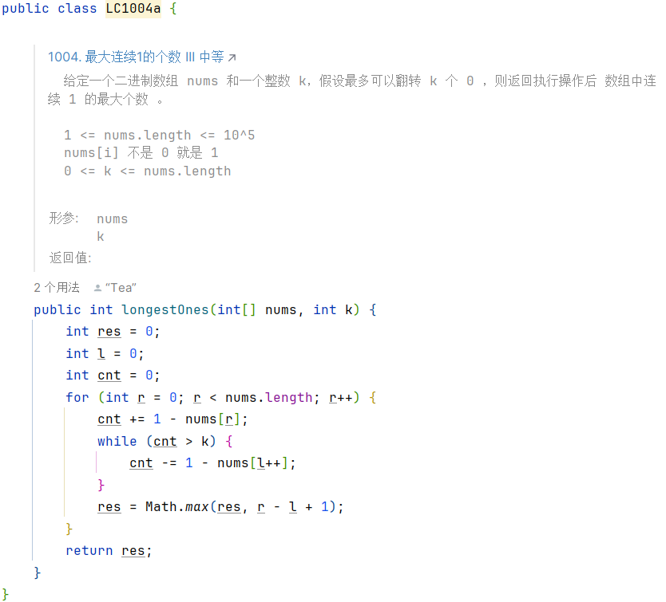
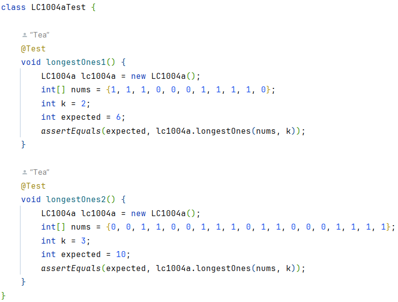

## 科学刷题

#### 站在[灵茶山艾府](https://leetcode.cn/u/endlesscheng/)的肩膀上

#### 版本
```
jdk21
```

### 目录结构
(包含代码测试用例,方便断点调试)

```text
## main
com.algorithm.boot
    ⊢ datastructure
        ⊢ ListNode.java
        ⌞ TreeNode.java
    ⌞ leetcode
        ⌞ lc1_99
            ⊢ LC2a.java
            ⊢ ...
            ⌞ LC98a.java
          lc100_199
          ...
          lc3400_3499
            ⌞ LC3439aTest.java
## test
com.algorithm.boot
    ⌞ leetcode
        ⌞ lc1_99
            ⊢ LC2aTest.java
            ⊢ ...
            ⌞ LC98aTest.java
          lc100_199
          ...
          lc3400_3499
            ⌞ LC3439aTest.java

```

示例
```java
public class LC1004a {

    /**
     * <a href="https://leetcode.cn/problems/max-consecutive-ones-iii/">1004. 最大连续1的个数 III 中等</a> <pre>
     * 给定一个二进制数组 nums 和一个整数 k，假设最多可以翻转 k 个 0 ，则返回执行操作后 数组中连续 1 的最大个数 。
     *
     * 1 <= nums.length <= 10^5
     * nums[i] 不是 0 就是 1
     * 0 <= k <= nums.length
     * </pre>
     * @param nums
     * @param k
     * @return
     */
    public int longestOnes(int[] nums, int k) {
        int res = 0;
        int l = 0;
        int cnt = 0;
        for (int r = 0; r < nums.length; r++) {
            cnt += 1 - nums[r];
            while (cnt > k) {
                cnt -= 1 - nums[l++];
            }
            res = Math.max(res, r - l + 1);
        }
        return res;
    }
}

class LC1004aTest {

    @Test
    void longestOnes1() {
        LC1004a lc1004a = new LC1004a();
        int[] nums = {1, 1, 1, 0, 0, 0, 1, 1, 1, 1, 0};
        int k = 2;
        int expected = 6;
        assertEquals(expected, lc1004a.longestOnes(nums, k));
    }

    @Test
    void longestOnes2() {
        LC1004a lc1004a = new LC1004a();
        int[] nums = {0, 0, 1, 1, 0, 0, 1, 1, 1, 0, 1, 1, 0, 0, 0, 1, 1, 1, 1};
        int k = 3;
        int expected = 10;
        assertEquals(expected, lc1004a.longestOnes(nums, k));
    }
}
```



