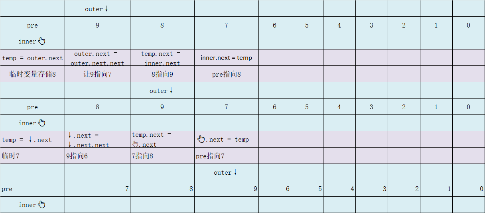
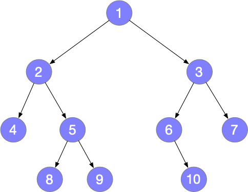

# 1.基础数据结构

## 数组

### 三种遍历方式

- forEach 

​	需要接受consumer对象

- Iterator迭代器遍历 

​	需要实现Iterator接口

- stream流

```java

    public void foreach(Consumer<Integer> consumer) {
        for (int i = 0; i < size; i++) {
            consumer.accept(array[i]);
        }
    }

    /**
     * 遍历方法2 - 迭代器遍历
     */
    @Override
    public Iterator<Integer> iterator() {
        return new Iterator<Integer>() {
            int i = 0;

            @Override
            public boolean hasNext() {
                return i < size;
            }

            @Override
            public Integer next() {
                return array[i++];
            }
        };
    }

    /**
     * 遍历方法3 - stream 遍历
     *
     * @return stream 流
     */
    public IntStream stream() {
        return IntStream.of(Arrays.copyOfRange(array, 0, size));
    }
```


## 链表

### 遍历链表

#### [1290. 二进制链表转整数](https://leetcode.cn/problems/convert-binary-number-in-a-linked-list-to-integer/)

#### [2058. 找出临界点之间的最小和最大距离](https://leetcode.cn/problems/find-the-minimum-and-maximum-number-of-nodes-between-critical-points/)

#### [2181. 合并零之间的节点](https://leetcode.cn/problems/merge-nodes-in-between-zeros/)

#### [725. 分隔链表](https://leetcode.cn/problems/split-linked-list-in-parts/)

#### [817. 链表组件](https://leetcode.cn/problems/linked-list-components/)

### 删除节点

#### [203. 移除链表元素](https://leetcode.cn/problems/remove-linked-list-elements/)

- 删除节点，需要使用上一个节点指向当前节点的下一个点
  如1 -> 2 -> 3 ==>> 1 -> 3
- 需要删除头节点的情况，准备一个哨兵节点指向头节点

#### [3217. 从链表中移除在数组中存在的节点](https://leetcode.cn/problems/delete-nodes-from-linked-list-present-in-array/)

在203的基础上，使用set集合存放数组中的数

#### [83. 删除排序链表中的重复元素](https://leetcode.cn/problems/remove-duplicates-from-sorted-list/)

例：1 -> 1 -> 2 -> 3 => 1 -> 2 -> 3

- **注意**：同时操控两个节点遍历时，注意边界，第二个节点为空的情况
  1 -> 1 -> 2 -> 3 => 1 -> 2 -> 3

#### [82. 删除排序链表中的重复元素 II](https://leetcode.cn/problems/remove-duplicates-from-sorted-list-ii/)

例：1 -> 1 -> 2 -> 3 => 2 -> 3

- 相对于83，增加了需要删除重复节点本身，以及可能删除头节点的情况
  ```java
  public ListNode deleteDuplicates(ListNode head) {
      ListNode dummy = new ListNode(-101, head);
      ListNode curr = dummy;
      while (curr.next != null && curr.next.next != null) {
          int val = curr.next.val;
          if (curr.next.next.val == val) {
              /*
              curr,curr.next,curr.next.next分别相当于前中后
              不断让前的指针指向后，也即是不断的跳过中节点，保证了删除所有中间节点
               */
              while (curr.next != null && curr.next.val == val) {
                  curr.next = curr.next.next;
              }
          } else {
              curr = curr.next;
          }
      }
      return dummy.next;
  }
  ```

  

#### [237. 删除链表中的节点](https://leetcode.cn/problems/delete-node-in-a-linked-list/)

> 在链表中删除给定节点，且调用方法时，只给出目标节点，不给出头节点

- 将下一个节点的值赋给当前节点，然后删除下一个节点

#### [1669. 合并两个链表](https://leetcode.cn/problems/merge-in-between-linked-lists/)

给你两个链表 `list1` 和 `list2` ，它们包含的元素分别为 `n` 个和 `m` 个。
请你将 `list1` 中下标从 `a` 到 `b` 的全部节点都删除，并将`list2` 接在被删除节点的位置。
下图中蓝色边和节点展示了操作后的结果：


#### [2487. 从链表中移除节点](https://leetcode.cn/problems/remove-nodes-from-linked-list/)

给你一个链表的头节点 `head` 。
移除每个右侧有一个更大数值的节点。
返回修改后链表的头节点 `head` 。

- 用模拟的方式去删除节点，节点前后关系会很复杂，用递归去做，递归的本质就是正反遍历链表

```java
public ListNode removeNodes(ListNode head) {
    if (head.next == null) {
        return head;
    }
    ListNode node = removeNodes(head.next); // 返回的链表头一定是最大的
    if (node.val > head.val) {
        return node; // 删除 head
    }
    head.next = node; // 不删除 head
    return head;
}
```

### 插入节点

#### [2807. 在链表中插入最大公约数](https://leetcode.cn/problems/insert-greatest-common-divisors-in-linked-list/)

> 在相邻结点之间，请你插入一个新的结点，结点值为这两个相邻结点值的 **最大公约数** 。

```java
public ListNode insertGreatestCommonDivisors(ListNode head) {
        ListNode node = head;
        while (node.next != null) {
            node.next = new ListNode(gcd(node.val, node.next.val), node.next);
            node = node.next.next;
        }
        return head;
    }

	/**
	* gcd 算法，可以通过BigInteger的实力对象，以a.gcd(b)的方法实现。
	*/
    private int gcd(int num1, int num2) {
        int a = Math.max(num1, num2);
        int b = Math.min(num1, num2);
        int c = a % b;
        while (c != 0) {
            a = b;
            b = c;
            c = a % b;
        }
        return b;
    }
```


#### [147. 对链表进行插入排序](https://leetcode.cn/problems/insertion-sort-list/)



复杂链表务必画图
```java
public ListNode insertionSortList(ListNode head) {
    ListNode dummy = new ListNode(0, head);
    ListNode outer = head;
    while (outer.next != null) {
        ListNode inner = dummy;
        while (inner.next != null) {
            if (inner.next == outer.next) {
                outer = outer.next;
                break;
            }
            if (outer.next.val < inner.next.val) {
                ListNode temp = outer.next;
                outer.next = outer.next.next;
                temp.next = inner.next;
                inner.next = temp;
                break;
            }
            inner = inner.next;
        }
    }
    return dummy.next;
}
```

### 反转链表

#### [206. 反转链表](https://leetcode.cn/problems/reverse-linked-list/)

> 给你单链表的头节点 `head` ，请你反转链表，并返回反转后的链表。

- 迭代
  ```java
  public ListNode reverseList(ListNode head) {
      ListNode prev = null;
      ListNode curr = head;
      while (curr != null) {
          ListNode next = curr.next;
          curr.next = prev;
          prev = curr;
          curr = next;
      }
      return prev;
  }
  ```

- 递归
  ```java
  public ListNode reverseList(ListNode head) {
      ListNode dummy = new ListNode();
      ListNode node = recur(head, dummy);
      node.next = null;
      return dummy.next;
  }
  
  private ListNode recur(ListNode node, ListNode dummy) {
      if (node == null) return dummy;
      ListNode last = recur(node.next, dummy);
      last.next = node;
      return node;
  }
  ==============优化===================
  public ListNode reverseList(ListNode head) {
      if (head == null || head.next == null) return head;
      // 因为head.next == null 保证了，head肯定不为空，最里层的head也就是最后一个节点
      ListNode newHead = reverseList(head.next); // newHead一直是同一个节点
      head.next.next = head;  // 里层节点指向外层节点
      head.next = null;       // 最外层节点指向空
      return newHead;
  }
  ```
  
  

#### [92. 反转链表 II](https://leetcode.cn/problems/reverse-linked-list-ii/)

> 给你单链表的头指针 `head` 和两个整数 `left` 和 `right` ，其中 `left <= right` 。请你反转从位置 `left` 到位置 `right` 的链表节点，返回 **反转后的链表** 。

- 两次遍历
  

  ```java
  public ListNode reverseBetween(ListNode head, int left, int right) {
      // 因为头节点有可能发生变化，使用虚拟头节点可以避免复杂的分类讨论
      ListNode dummyNode = new ListNode(-1);
      dummyNode.next = head;
  
      ListNode pre = dummyNode;
      // 第 1 步：从虚拟头节点走 left - 1 步，来到 left 节点的前一个节点
      // 建议写在 for 循环里，语义清晰
      for (int i = 0; i < left - 1; i++) {
          pre = pre.next;
      }
  
      // 第 2 步：从 pre 再走 right - left + 1 步，来到 right 节点
      ListNode rightNode = pre;
      for (int i = 0; i < right - left + 1; i++) {
          rightNode = rightNode.next;
      }
  
      // 第 3 步：切断出一个子链表（截取链表）
      ListNode leftNode = pre.next;
      ListNode curr = rightNode.next;
  
      // 注意：切断链接
      pre.next = null;
      rightNode.next = null;
  
      // 第 4 步：同第 206 题，反转链表的子区间
      reverseLinkedList(leftNode);
  
      // 第 5 步：接回到原来的链表中
      pre.next = rightNode;
      leftNode.next = curr;
      return dummyNode.next;
  }
  
  private void reverseLinkedList(ListNode head) {
      // 也可以使用递归反转一个链表
      ListNode pre = null;
      ListNode cur = head;
  
      while (cur != null) {
          ListNode next = cur.next;
          cur.next = pre;
          pre = cur;
          cur = next;
      }
  }
  ```

  

- 一次遍历
  

  ```java
  public ListNode reverseBetween(ListNode head, int left, int right) {
      ListNode dummy = new ListNode(0, head); //头节点变动一般都要准备一个哨兵
      ListNode pre = dummy;       // left前一个节点，指向反转后的部分链表
      for (int i = 0; i < left - 1; i++) pre = pre.next;
      ListNode cur = pre.next;
      // 插入法，将当前cur插入到pre后面
      for (int i = 0; i < right - left; i++) {
          ListNode next = cur.next;
          cur.next = next.next;
          next.next = pre.next;
          pre.next = next;
      }
      return dummy.next;
  }
  ```

#### [24. 两两交换链表中的节点](https://leetcode.cn/problems/swap-nodes-in-pairs/)

> 给你一个链表，两两交换其中相邻的节点，并返回交换后链表的头节点。你必须在不修改节点内部的值的情况下完成本题（即，只能进行节点交换）。

```java
public ListNode swapPairs(ListNode head) {
    if (head == null || head.next == null) return head;
    ListNode dummy = new ListNode(0, head);
    ListNode pre = dummy;
    ListNode cur = pre.next;
    /*
    pre -> cur -> nxt -> lat ==>
    pre -> nxt -> cur -> lat
     */
    while (cur.next != null) {
        ListNode nxt = cur.next;
        pre.next = nxt;
        cur.next = nxt.next;
        nxt.next = cur;

        pre = cur;
        cur = cur.next;
    }
    return dummy.next;
}
```

#### [25. K 个一组翻转链表](https://leetcode.cn/problems/reverse-nodes-in-k-group/)

#### [2074. 反转偶数长度组的节点](https://leetcode.cn/problems/reverse-nodes-in-even-length-groups/)

> 给你一个链表的头节点 `head` 。
> 链表中的节点 **按顺序** 划分成若干 **非空** 组，这些非空组的长度构成一个自然数序列（`1, 2, 3, 4, ...`）。一个组的 **长度** 就是组中分配到的节点数目。换句话说：
> - 节点 `1` 分配给第一组
> - 节点 `2` 和 `3` 分配给第二组
> - 节点 `4`、`5` 和 `6` 分配给第三组，以此类推
>
> 注意，最后一组的长度可能小于或者等于 `1 + 倒数第二组的长度` 。

**反转** 每个 **偶数** 长度组中的节点，并返回修改后链表的头节点 `head` 。

```java
public ListNode reverseEvenLengthGroups(ListNode head) {
    ArrayList<ListNode> nodes = new ArrayList<>();
    int size = 1;
    for (ListNode node = head; node != null; node = node.next) {
        nodes.add(node);
        if (nodes.size() == size || node.next == null) {	// 统计到 size 个节点，或到达链表末尾
            int n = nodes.size();
            if (n % 2 == 0) {								// 有偶数个节点
                for (int i = 0; i < n / 2; i++) {
                    int temp = nodes.get(i).val;
                    nodes.get(i).val = nodes.get(n - 1 - i).val;
                    nodes.get(n - 1 - i).val = temp;
                }
            }
            nodes.clear();
            size++;
        }
    }
    return head;
}
```

### 前后指针

#### [19. 删除链表的倒数第 N 个结点](https://leetcode.cn/problems/remove-nth-node-from-end-of-list/)

#### [61. 旋转链表](https://leetcode.cn/problems/rotate-list/)

> 给你一个链表的头节点 `head` ，旋转链表，将链表每个节点向右移动 `k` 个位置。
>
> 示例1
> 
>
> > 输入：head = [1,2,3,4,5], k = 2
> > 输出：[4,5,1,2,3]

```java
public ListNode rotateRight(ListNode head, int k) {
    if (k == 0 || head == null || head.next == null) return head;
    int n = 1;
    ListNode iter = head;
    while (iter.next != null) {
        iter = iter.next;
        n++;
    }
    // k % n表示向前移动k位置， n - k % n表示向后移动k个位置
    int offset = n - k % n;
    if (offset == n) return head;
    iter.next = head;
    while (offset-- > 0) {
        iter = iter.next;
    }
    head = iter.next;
    iter.next = null;
    return head;
}
```

#### [1721. 交换链表中的节点](https://leetcode.cn/problems/swapping-nodes-in-a-linked-list/)

>给你链表的头节点 `head` 和一个整数 `k` 。
>**交换** 链表正数第 `k` 个节点和倒数第 `k` 个节点的值后，返回链表的头节点（链表 **从 1 开始索引**）。
>
>示例1
>
>> 
>>
>> 输入：head = [1,2,3,4,5], k = 2
>> 输出：[1,4,3,2,5]

```java
public ListNode swapNodes(ListNode head, int k) {
    ListNode first = head;
    ListNode last = head;
    ListNode curr = head;
    // 计数
    int cnt = 1;    
    // curr == null 会多走一步
    while (curr.next != null) {
        if (cnt++ < k) {
            first = first.next;
        } else {
            last = last.next;
        }
        curr = curr.next;
    }
    cnt = first.val;
    first.val = last.val;
    last.val = cnt;
    return head;
}
```


### 快慢指针

#### [876. 链表的中间结点](https://leetcode.cn/problems/middle-of-the-linked-list/)

>给你单链表的头结点 `head` ，请你找出并返回链表的中间结点。
>如果有两个中间结点，则返回第二个中间结点。

- 快慢指针

```java
public ListNode middleNode(ListNode head) {
    ListNode slow = head;
    ListNode quick = head;

    while (quick.next != null && quick.next.next != null) {
        quick = quick.next.next;
        slow = slow.next;
    }
    if (quick.next == null) {
        return slow;
    } else {
        return slow.next;
    }
}
```


#### [2095. 删除链表的中间节点](https://leetcode.cn/problems/delete-the-middle-node-of-a-linked-list/)

> 给你单链表的头结点 `head` ，请你删除链表的中间结点。
> 如果有两个中间结点，则删除第二个中间结点。

```java
public ListNode deleteMiddle(ListNode head) {
    ListNode dummy = new ListNode(0, head);
    ListNode pre = dummy;
    ListNode slow = head;
    ListNode quick = head;

    while (quick.next != null && quick.next.next != null) {
        quick = quick.next.next;
        slow = slow.next;
        pre = pre.next;
    }
    if (quick.next == null){
        pre.next = slow.next;
    } else {
        slow.next = slow.next.next;
    }
    return dummy.next;
}
```


#### [234. 回文链表](https://leetcode.cn/problems/palindrome-linked-list/)

> 给你一个单链表的头节点 `head` ，请你判断该链表是否为回文链表。如果是，返回 `true` ；否则，返回 `false` 。

- 快慢指针 + 栈
- 快慢指针 + 链表反转

#### [2130. 链表最大孪生和](https://leetcode.cn/problems/maximum-twin-sum-of-a-linked-list/)

- 快慢指针 + 链表反转

#### [143. 重排链表](https://leetcode.cn/problems/reorder-list/)

> 给定一个单链表 L 的头节点 head ，单链表 L 表示为
> L0 → L1 → … → Ln - 1 → Ln
> 请将其重新排列后变为：
> L0 → Ln → L1 → Ln - 1 → L2 → L
> 不能只是单纯的改变节点内部的值，而是需要实际的进行节点交换。

- 快慢指针 + 反转链表

```java
/*
相当于，把链表从中间切成两端，将后半部分链表倒着插入到前面的链表
0 -> 1 -> 2 -> 3 -> 4 // 5 -> 6 -> 7 -> 8 -> (9)
0 -> 1 -> 2 -> 3 -> 4
   8    7    6    5   (x)
 */
public void reorderList(ListNode head) {
    // 1. 找到中心节点
    ListNode midNode = getMidNode(head);
    ListNode temp = midNode;
    midNode = midNode.next;
    temp.next = null;
    // 2. 反转后半部分
    midNode = reverse(midNode);
    // 3.依次插入
    ListNode curr = head;
    ListNode pre = null;
    while (midNode != null) {
        ListNode point = midNode;
        ListNode next = curr.next;
        midNode = midNode.next;

        pre = curr;
        curr = curr.next;
        pre.next = point;
        point.next = next;
    }
}

private ListNode getMidNode(ListNode head) {
    ListNode slow = head;
    ListNode quick = head;
    while (quick.next != null && quick.next.next != null) {
        slow = slow.next;
        quick = quick.next.next;
    }
    return slow;
}

private ListNode reverse(ListNode head) {
    ListNode pre = null;
    ListNode curr = head;
    while (curr != null) {
        ListNode next = curr.next;
        curr.next = pre;
        pre = curr;
        curr = next;
    }
    return pre;
}
```


#### [141. 环形链表](https://leetcode.cn/problems/linked-list-cycle/)

>给你一个链表的头节点 `head` ，判断链表中是否有环。

判断唤醒链表一般使用快慢指针，此处也可使用hash表

#### [142. 环形链表 II](https://leetcode.cn/problems/linked-list-cycle-ii/)

> 给定一个链表的头节点  `head` ，返回链表开始入环的第一个节点。 *如果链表无环，则返回 `null`。*

仍然可使用哈希表，此处使用快慢指针

- 如果有环
  快慢指针相遇的时候，增加第三个指针，从head出发一次移动一步，慢指针也继续移动，慢指针与三指针重合位置必定是之前与快指针相遇的位置，因为慢指针此时走的总距离与快指针第一次相遇时是一样的，如果速度相同想要重合，则必然是在入环的时候就相遇，所以第三个指针与慢指针第一次重合时，就是环的起点

```java
public ListNode detectCycle(ListNode head) {
    if (head == null) return null;
    ListNode fast = head;
    ListNode slow = head;
    while (fast != null && fast.next != null && fast.next.next != null) {
        fast = fast.next.next;
        slow = slow.next;
        if (fast == slow) {
            ListNode ptr = head;
            while (ptr != slow) {
                ptr = ptr.next;
                slow = slow.next;
            }
            return slow;
        }
    }
    return null;
}
```


#### [457. 环形数组是否存在循环](https://leetcode.cn/problems/circular-array-loop/)

- 快慢指针 走过的路记为0

```java
public boolean circularArrayLoop(int[] nums) {
    int n = nums.length;
    for (int i = 0; i < n; i++) {
        if (nums[i] == 0) continue;
        int slow = i;
        int fast = next(nums, i);
        // 判断非0，且方向相同,分别保证奇数步和偶数步情况
        while (nums[slow] * nums[fast] > 0 && nums[slow] * nums[next(nums, fast)] > 0) {
            if (slow == fast) {
                // 长度大于0
                if (slow != next(nums, slow)) {
                    return true;
                } else break;
            }
            slow = next(nums, slow);
            fast = next(nums, next(nums, fast));
        }
        // 将i节点的环路径所有点置0,保证>0,小于0是上面while循环还没有走过的路
        int j = i;
        while (nums[j] * nums[next(nums, j)] > 0) {
            int tmp = j;
            j = next(nums, j);
            nums[tmp] = 0;
        }
    }
    return false;
}

private int next(int[] nums, int i) {
    int n = nums.length;
    // 下一个位置的索引，可能大于n，也可能小于-n
    int index = i + nums[i];
    // 保证在[0,n)之间
    return ((index % n) + n) % n;
}
```

### 双指针

#### [328. 奇偶链表](https://leetcode.cn/problems/odd-even-linked-list/)

> 给定单链表的头节点 `head` ，将所有索引为奇数的节点和索引为偶数的节点分别组合在一起，然后返回重新排序的列表。
> **第一个**节点的索引被认为是 **奇数** ， **第二个**节点的索引为 **偶数** ，以此类推。
> 请注意，偶数组和奇数组内部的相对顺序应该与输入时保持一致。
> 你必须在 `O(1)` 的额外空间复杂度和 `O(n)` 的时间复杂度下解决这个问题。
> 
>
> >输入: head = [1,2,3,4,5]
> >输出: [1,3,5,2,4]

- 双指针

```java
public ListNode oddEvenList(ListNode head) {
    if (head == null) return head;
    ListNode odd = head;
    ListNode evenHead = head.next;
    ListNode even = evenHead;
    while (even != null && even.next != null) {
        odd.next = even.next;
        odd = odd.next;
        even.next = odd.next;
        even = even.next;
    }
    // odd此时一定是最后一个奇指针
    odd.next = evenHead;
    return head;
}
```


#### [86. 分隔链表](https://leetcode.cn/problems/partition-list/)

>给你一个链表的头节点 `head` 和一个特定值 `x` ，请你对链表进行分隔，使得所有 **小于** `x` 的节点都出现在 **大于或等于** `x` 的节点之前。
>你应当 **保留** 两个分区中每个节点的初始相对位置。

```java
public ListNode partition(ListNode head, int x) {
    ListNode bigDummy = new ListNode(0);
    ListNode smlDummy = new ListNode(0);
    ListNode big = bigDummy;
    ListNode sml = smlDummy;
    while (head != null) {
        if (head.val < x) {
            sml.next = head;
            sml = sml.next;
        } else {
            big.next = head;
            big = big.next;
        }
        head = head.next;
    }
    big.next = null;
    sml.next = bigDummy.next;
    return smlDummy.next;
}
```


#### [160. 相交链表](https://leetcode.cn/problems/intersection-of-two-linked-lists/)

> 给你两个单链表的头节点 `headA` 和 `headB` ，请你找出并返回两个单链表相交的起始节点。如果两个链表不存在相交节点，返回 `null` 。

- 哈希表

- 双指针

  链表可分为两种情况，
  - 相交
     将链表分别分成两段表示

     - aList： a + c
     - bList： b + c

     如果ab相等，
         则相交时直接返回
     ab不相等
          a遍历完后指向b，b遍历完后指向a
          - a指针： a -> c -> b -> c
               - b指针： b -> c -> a -> c
      此时ab走过的路程会相同，当ab指针相等时直接返回

  - 不相交
       a指针： a -> b -> null
       b指针： b -> a -> null
       同时指向null

  ```java
  public ListNode getIntersectionNode(ListNode headA, ListNode headB) {
      if (headA == null || headB == null) return null;
      ListNode pA = headA, pB = headB;
      while (pA != pB) {
          pA = pA == null ? headB : pA.next;
          pB = pB == null ? headA : pB.next;
      }
      return pA;
  }
  ```

### 合并链表

#### [2. 两数相加](https://leetcode.cn/problems/add-two-numbers/)

> 给你两个 **非空** 的链表，表示两个非负的整数。它们每位数字都是按照 **逆序** (也即是头节点为个位)的方式存储的，并且每个节点只能存储 **一位** 数字。
> 请你将两个数相加，并以相同形式返回一个表示和的链表。
> 你可以假设除了数字 0 之外，这两个数都不会以 0 开头。

```java
public ListNode addTwoNumbers(ListNode l1, ListNode l2) {
    int carry = 0;
    ListNode head = new ListNode(0);
    ListNode curr = head;
    ListNode pre = curr;
    while (l1 != null || l2 != null) {
        int n1 = l1 == null ? 0 : l1.val;
        int n2 = l2 == null ? 0 : l2.val;
        int num = carry + n1 + n2;
        carry = num / 10;
        curr.val = num % 10;
        curr.next = new ListNode(0);
        pre = curr;
        curr = curr.next;
        if (l1 != null) l1 = l1.next;
        if (l2 != null) l2 = l2.next;
    }
    curr.val = carry;
    if (carry == 0) pre.next = null;
    return head;
}
```


#### [445. 两数相加 II](https://leetcode.cn/problems/add-two-numbers-ii/)

> 给你两个 **非空** 链表来代表两个非负整数。数字最高位位于链表开始位置。它们的每个节点只存储一位数字。将这两数相加会返回一个新的链表。
>
> 你可以假设除了数字 0 之外，这两个数字都不会以零开头。

#### [2816. 翻倍以链表形式表示的数字](https://leetcode.cn/problems/double-a-number-represented-as-a-linked-list/)

>给你一个 **非空** 链表的头节点 `head` ，表示一个不含前导零的非负数整数。
>将链表 **翻倍** 后，返回头节点 `head` 。

```java
public ListNode doubleIt(ListNode head) {
    if(head.val > 4) {
        head = new ListNode(0,head);
    }
    for (ListNode cur = head; cur != null; cur = cur.next) {
        cur.val = cur.val * 2 % 10;
        if (cur.next != null && cur.next.val > 4) {
            cur.val++;
        }
    }
    return head;
}
```


#### [21. 合并两个有序链表](https://leetcode.cn/problems/merge-two-sorted-lists/)

```java
public ListNode mergeTwoLists(ListNode list1, ListNode list2) {
        ListNode dummy = new ListNode(0);
        ListNode pre = dummy;
        while (list1 != null && list2 !=null) {
            if (list1.val > list2.val) {
                pre.next = list2;
                list2 = list2.next;
            } else {
                pre.next = list1;
                list1 = list1.next;
            }
            pre = pre.next;
        }
        pre.next = list1 == null ? list2 : list1;
        return dummy.next;
    }
```


### 分治

#### [23. 合并 K 个升序链表](https://leetcode.cn/problems/merge-k-sorted-lists/) 也可用堆

> 将两个升序链表合并为一个新的 **升序** 链表并返回。新链表是通过拼接给定的两个链表的所有节点组成的。

- 小顶堆
  将所有链表节点都存入小顶堆中，依次从堆中读出，拼接为链表

  ```java
  public ListNode mergeKLists(ListNode[] lists) {
      PriorityQueue<ListNode> heap = new PriorityQueue<>((a, b) -> a.val - b.val);
      for (ListNode head : lists) {
          if (head != null) heap.offer(head);
      }
      ListNode dummy = new ListNode(0);
      ListNode cur = dummy;
      while (!heap.isEmpty()) {
          ListNode node = heap.poll();
          if (node.next != null) {
              heap.offer(node.next);
          }
          cur.next = node;
          cur = cur.next;
      }
      return dummy.next;
  }
  ```

- 分治

  把 lists 一分为二（尽量均分），先合并前一半的链表，再合并后一半的链表，然后把这两个链表合并成最终的链表。
  如何合并前一半的链表呢？我们可以继续一分为二。如此分下去直到只有一个链表，此时无需合并。

  ```java
  public ListNode mergeKLists(ListNode[] lists) {
      return mergeKLists(lists,0,lists.length);
  }
  
  private ListNode mergeKLists(ListNode[] lists, int i, int j) {
      int m = j - i;
      if (m == 0) return null;
      if (m == 1) return lists[i];
      ListNode left = mergeKLists(lists, i, (j + i) / 2);
      ListNode right = mergeKLists(lists, (j + i) / 2, j);
  
      return mergeTwoLists(left, right);
  }
  // 21. 合并两个有序链表
  private ListNode mergeTwoLists(ListNode list1, ListNode list2) {
      ListNode dummy = new ListNode(0);
      ListNode pre = dummy;
      while (list1 != null && list2 !=null) {
          if (list1.val > list2.val) {
              pre.next = list2;
              list2 = list2.next;
          } else {
              pre.next = list1;
              list1 = list1.next;
          }
          pre = pre.next;
      }
      pre.next = list1 == null ? list2 : list1;
      return dummy.next;
  }
  ```


#### [148. 排序链表](https://leetcode.cn/problems/sort-list/)

> 给你链表的头结点 `head` ，请将其按 **升序** 排列并返回 **排序后的链表** 。

- 归并排序（自顶向下，递归）
  

```java
public ListNode sortList(ListNode head) {
    if (head == null || head.next == null) return head;
    ListNode fast = head.next, slow = head;
    while (fast != null && fast.next != null) {
        slow = slow.next;
        fast = fast.next.next;
    }
    // 切断为两个链表
    ListNode tmp = slow.next;
    slow.next = null;
    ListNode left = sortList(head);
    ListNode right = sortList(tmp);
    // 21.合并两个有序链表
    return mergeTwoLists(left,right);
}
// 21.合并两个有序链表
public ListNode mergeTwoLists(ListNode list1, ListNode list2)
```

- 归并排序（自底向上，迭代）
  

  ```java
  public ListNode sortList(ListNode head) {
      // 获取链表长度
      int len = getLength(head);
      ListNode dummy = new ListNode(0, head);
      // 将链表依次拆分成长度为intv = 1,2,4,8...的子链表
      for (int intv = 1; intv < len; intv *= 2) {
          // 每次变换长度时，都初始化到链表头
          ListNode pre = dummy;
          ListNode cur = dummy.next;
          /*
           遍历每个步长的子链表，分别排序
           intv = 1, 1与2, 3与4, 5与6, 7与8
           intv = 2, 1-2与3-4, 5-6与7-8
           intv = 4, 1-4与5-8
           */
          while (cur != null) {
              ListNode h1 = cur;              // 第一部分的头节点
              ListNode h2 = split(h1, intv);  // 第二部分的头节点
              cur = split(h2, intv);          // 第三部分的头节点
              ListNode temp = mergeTwoLists(h1, h2);  // 合并两个有序链表
              pre.next = temp;                // 前置节点指向h1
              while (pre.next != null) {      // 前置节点变为h2尾节点
                  pre = pre.next;
              }
          }
      }
      return dummy.next;
  }
  // 21. 合并两个有序链表
  private ListNode mergeTwoLists(ListNode list1, ListNode list2)
  
  private ListNode split(ListNode h1, int intv) {
      for (int i = 0; i < intv - 1; i++) {
          if (h1 != null) {
              h1 = h1.next;
          }
      }
      if (h1 == null) return h1;
      ListNode h2 = h1.next;
      h1.next = null;
      return h2;
  }
  
  private int getLength(ListNode head) {
      int len = 0;
      while (head != null) {
          head = head.next;
          len++;
      }
      return len;
  }
  ```


### 综合应用

#### [1019. 链表中的下一个更大节点](https://leetcode.cn/problems/next-greater-node-in-linked-list/)

> 给定一个长度为 `n` 的链表 `head`,对于每个节点,找到后面第一个大于它的节点,按照节点顺序,以数组的形式返回

- **方一:** 暴力双循环

- **方二:**单调栈,从尾往头遍历,需先反转链表

  1. 反转链表,遍历
  2. 比较节点与栈顶元素的大小,比自己大的元素即为下一个更大值
     - 将小的弹出
     - 如果自己更大,加入栈

  ```java
  public int[] nextLargerNodes(ListNode head) {
      head = reverseList(head);
      var ans = new int[n];
      var st = new ArrayDeque<Integer>(); // 单调栈（节点值）
      for (var cur = head; cur != null; cur = cur.next) {
          while (!st.isEmpty() && cur.val >= st.peek()) st.pop();
          ans[--n] = st.isEmpty() ? 0 : st.peek();
          st.push(cur.val);
      }
      return ans;
  }
  
  // 206. 反转链表
  public ListNode reverseList(ListNode head)
  ```

#### [1171. 从链表中删去总和值为零的连续节点](https://leetcode.cn/problems/remove-zero-sum-consecutive-nodes-from-linked-list/)

> 给你一个链表的头节点 `head`，请你编写代码，反复删去链表中由 **总和** 值为 `0` 的连续节点组成的序列，直到不存在这样的序列为止。删除完毕后，请你返回最终结果链表的头节点。
>
> 你可以返回任何满足题目要求的答案。

- 前缀和 + 哈希表
  在哈希表中存入key为当前前缀和,value为当前节点,再次遇到相同前缀和,即说明这段节点和为0.

  

  ```java
  public ListNode removeZeroSumSublists(ListNode head) {
      if (head == null) return head;
      var map = new HashMap<Integer, ListNode>();
      ListNode dummy = new ListNode(0, head);
      map.put(0, dummy);
      int sum = 0;
      for (var cur = head; cur != null; cur = cur.next) {
          sum += cur.val;
          if (map.containsKey(sum)) {
              var pre = map.get(sum);
              var del = pre.next;
              pre.next = cur.next;
  
              var delSum = sum;
              while (del != cur) {
                  delSum += del.val;
                  map.remove(delSum);
                  del = del.next;
              }
          } else {
              map.put(sum, cur);
          }
      }
      return dummy.next;
  }
  ```

  

#### [707. 设计链表](https://leetcode.cn/problems/design-linked-list/)


#### [146. LRU 缓存](https://leetcode.cn/problems/lru-cache/)

> 请你设计并实现一个满足 [LRU (最近最少使用) 缓存](https://baike.baidu.com/item/LRU) 约束的数据结构。
>
> 实现 `LRUCache` 类：
>
> - `LRUCache(int capacity)` 以 **正整数** 作为容量 `capacity` 初始化 LRU 缓存
> - `int get(int key)` 如果关键字 `key` 存在于缓存中，则返回关键字的值，否则返回 `-1` 。
> - `void put(int key, int value)` 如果关键字 `key` 已经存在，则变更其数据值 `value` ；如果不存在，则向缓存中插入该组 `key-value` 。如果插入操作导致关键字数量超过 `capacity` ，则应该 **逐出** 最久未使用的关键字。
>
> 函数 `get` 和 `put` 必须以 `O(1)` 的平均时间复杂度运行。

- 双向链表 + 哈希表

  - 内部节点以双向链表的形式链接,加入头尾节点辅助,
  - 哈希表作为索引,快速定位节点位置

  注意

  - 加入,在哈希表中查出节点,移动到头部
  - 超出容量,移除尾部节点

#### [460. LFU 缓存](https://leetcode.cn/problems/lfu-cache/)

> 为 最不经常使用（LFU）缓存算法设计并实现数据结构
>
> 实现 `LFUCache` 类：
>
> - `LFUCache(int capacity)` - 用数据结构的容量 `capacity` 初始化对象
> - `int get(int key)` - 如果键 `key` 存在于缓存中，则获取键的值，否则返回 `-1` 。
> - `void put(int key, int value)` - 如果键 `key` 已存在，则变更其值；如果键不存在，请插入键值对。当缓存达到其容量 `capacity` 时，则应该在插入新项之前，移除最不经常使用的项。在此问题中，当存在平局（即两个或更多个键具有相同使用频率）时，应该去除 **最久未使用** 的键。
>
> 函数 `get` 和 `put` 必须以 `O(1)` 的平均时间复杂度运行。

- 使用两个哈希表,数据结构如下

  ```java
  class LFUCache {
      private static class Node {
          int key, value, freq = 1;	// key,value,访问频次(次数)
          Node prev, next;			// 前,后
          Node(int key, int value) {
              this.key = key;
              this.value = value;
          }
      }
  
      private final int capacity;									// 缓存容量,初始化时确认
      private final Map<Integer, Node> keyMap = new HashMap<>();	// 节点索引,用来快速找到该值对应的节点
      private final Map<Integer, Node> freqMap = new HashMap<>();	// 频次索引,用来快速找到该频次的链表头
      private int minFreq;			// 当前最小频次,容量满后用来删除频次最低的节点,新增节点重置为1
      
      public LFUCache(int capacity) {
          this.capacity = capacity;
      }
      
      public int get(int key) {
      }
      
      public void put(int key, int value) {
      }
  }
  ```

  

#### [432. 全 O(1) 的数据结构](https://leetcode.cn/problems/all-oone-data-structure/)

> 请你设计一个用于存储字符串计数的数据结构，并能够返回计数最小和最大的字符串。

#### [1206. 设计跳表](https://leetcode.cn/problems/design-skiplist/)

> 不使用任何库函数，设计一个 **跳表** 。
>
> **跳表** 是在 `O(log(n))` 时间内完成增加、删除、搜索操作的数据结构。跳表相比于树堆与红黑树，其功能与性能相当，并且跳表的代码长度相较下更短，其设计思想与链表相似。
>
> 例如，一个跳表包含 `[30, 40, 50, 60, 70, 90]` ，然后增加 `80`、`45` 到跳表中，以下图的方式操作：
> 
>
> 跳表中有很多层，每一层是一个短的链表。在第一层的作用下，增加、删除和搜索操作的时间复杂度不超过 `O(n)`。跳表的每一个操作的平均时间复杂度是 `O(log(n))`，空间复杂度是 `O(n)`。
> 注意，跳表中可能存在多个相同的值，你的代码需要处理这种情况。

- [说明](https://leetcode.cn/problems/design-skiplist/solutions/1698640/she-ji-tiao-biao-by-capital-worker-3vqk/)

  ```java
  public class Skiplist {
      private static class Node {
          int val;
          Node[] next;
          Node (int val, int maxLevel){
              this.val = val;
              this.next = new Node[maxLevel];
          }
      }
  
      private static final int MAX_LEVEL = 32;		// 最大阶层
      private static final double SKIPLIST_P = 0.25;	// 高度因子
      private final Node head;						// 头节点,从head.next[curLevel]作为跳表入口
      private int curLevel;							// 当前阶层高度
  
  
      public Skiplist() {
          this.head = new Node(0, MAX_LEVEL);
          curLevel = 0;
      }
  
      public boolean search(int target) {
          Node cur = this.head;
          for (int i = curLevel - 1; i >= 0; i--) {
              while (cur.next[i] != null && cur.next[i].val < target) {
                  cur = cur.next[i];
              }
          }
          cur = cur.next[0];
          return cur != null && cur.val == target;
      }
  
      public void add(int num) {
          Node[] update = new Node[MAX_LEVEL];
          Arrays.fill(update, head);
          Node cur = this.head;
          for (int i = curLevel - 1; i >= 0; i--) {
              while (cur.next[i] != null && cur.next[i].val < num) {
                  cur = cur.next[i];
              }
              update[i] = cur;
          }
          //if (cur.next[0] != null && cur.next[0].val == num) return;       // 该题允许有多个相同的num存在
          int randomLevel = randomLevel();
          this.curLevel = Math.max(randomLevel, this.curLevel);
          Node newNode = new Node(num, randomLevel);
          // 更新level对应的节点
          for (int i = 0; i < randomLevel; i++) {
              newNode.next[i] = update[i].next[i];
              update[i].next[i] = newNode;
          }
      }
  
      public boolean erase(int num) {
          Node[] update = new Node[MAX_LEVEL];
          Node cur = this.head;
          for (int i = curLevel - 1; i >= 0; i--) {
              //找到第i层最大的小于target的元素
              while (cur.next[i] != null && cur.next[i].val < num) {
                  cur = cur.next[i];
              }
              update[i] = cur;
          }
          cur = cur.next[0];
          //判断num是否存在
          if (cur == null || cur.val != num) {
              return false;
          }
          for (int i = 0; i < curLevel; i++) {
              if (update[i].next[i] != cur) {
                  break;
              }
              //删除第i层的值和num相等的元素
              update[i].next[i] = cur.next[i];
          }
          //有可能最上层只有一个元素，缩短层数
          while (curLevel > 1 && head.next[curLevel - 1] == null) {
              curLevel--;
          }
          return true;
      }
  
      private int randomLevel() {
          int level = 1;
          while (Math.random() < SKIPLIST_P && level < MAX_LEVEL) {
              level++;
          }
          return level;
      }
  }
  ```

  

### 其他

#### [138. 随机链表的复制](https://leetcode.cn/problems/copy-list-with-random-pointer/)

> 给你一个长度为 `n` 的链表，每个节点包含一个额外增加的随机指针 `random` ，该指针可以指向链表中的任何节点或空节点。
>
> 构造这个链表的 **[深拷贝](https://baike.baidu.com/item/深拷贝/22785317?fr=aladdin)**。 深拷贝应该正好由 `n` 个 **全新** 节点组成，其中每个新节点的值都设为其对应的原节点的值。新节点的 `next` 指针和 `random` 指针也都应指向复制链表中的新节点，并使原链表和复制链表中的这些指针能够表示相同的链表状态。**复制链表中的指针都不应指向原链表中的节点** 。
>
> ```java
> class Node {
>     int val;
>     Node next;
>     Node random;
> 
>     public Node(int val) {
>         this.val = val;
>         this.next = null;
>         this.random = null;
>     }
> }
> ```

- 哈希表

  key为源结点，value为拷贝的节点
  第一次遍历，新建所有节点存入hash表中
  第二次遍历，对应节点的关系

  ```java
  public Node copyRandomList(Node head) {
      Node cur = head;
      Map<Node, Node> cache = new HashMap<>();
      while (head != null) {
          cache.put(cur, new Node(cur.val));
          cur = cur.next;
      }
      cur = head;
      while (cur != null) {
          Node node = cache.get(cur);
          node.random = cache.get(cur.random);
          cur = cur.next;
          node.next = cache.get(cur);
      }
      return cache.get(head);
  }
  ```

- 回溯 + 哈希表

  ```java
  Map<Node, Node> cache = new HashMap<>();
  public Node copyRandomList(Node head) {
      if (head == null) return null;
      if (!cache.containsKey(head)) {
          Node copyNode = new Node(head.val);
          cache.put(head, copyNode);
          copyNode.next = copyRandomList(head.next);
          copyNode.random = copyRandomList(head.random);
      }
      return cache.get(head);
  }
  ```

- 迭代
  将复制节点,插到原节点后面

  1. 遍历节点,每次将复制节点插入到原节点后面
  2. 第二次遍历,将随机指针复制过去
  3. 第三次遍历,断开节点,组成需要的目标链表

#### [382. 链表随机节点](https://leetcode.cn/problems/linked-list-random-node/)

#### [430. 扁平化多级双向链表](https://leetcode.cn/problems/flatten-a-multilevel-doubly-linked-list/)

## 递归

### 斐波那契数列

### 记忆法


### 爆栈问题


### 递归时间复杂度计算

## 队列


## 栈


## 堆


## 二叉树

### 主要笔记区
##### 定义：

二叉树是一种树形数据结构，每个节点最多有两个子节点，通常称为“左子节点”和“右子节点”。

##### 遍历方法：

- 前序遍历（Preorder Traversal）：
  1. 访问根节点。
  2. 前序遍历左子树。
  3. 前序遍历右子树。
  
  ```java
  // 递归
  class Solution {
      public List<Integer> preorderTraversal(TreeNode root) {
          List<Integer> ret = new ArrayList<>();
          preOrderRecur(root, ret);
          return ret;
      }
  
      public void preOrderRecur(TreeNode head, List<Integer> ret) {
          if (head == null) {
              return;
          }
          ret.add(head.val);
          preOrderRecur(head.left, ret);
          preOrderRecur(head.right, ret);
      }
  }
  ```
  
  

- 中序遍历（Inorder Traversal）：

  1. 中序遍历左子树。
  2. 访问根节点。
  3. 中序遍历右子树。

  ```
  	inorderRecur(head.left, ret);
      ret.add(head.val);		// 中序遍历
      inorderRecur(head.right, ret);
  ```

- 后序遍历（Postorder Traversal）：
  1. 后序遍历左子树。
  2. 后序遍历右子树。
  3. 访问根节点。

  ```
  	inorderRecur(head.left, ret);
      inorderRecur(head.right, ret);
      ret.add(head.val);		// 后序遍历
  ```

- 层次遍历（Level-order Traversal）：
  按层从上到下，从左到右访问节点，通常使用队列实现。

##### 构造与修改：

- 构造：可以通过递归或迭代方法构造二叉树。
  从前序与中序遍历序列构造二叉树

  ```
  输入: preorder = [3,9,20,15,7], inorder = [9,3,15,20,7]
  输出: [3,9,20,null,null,15,7]
  ```

  - 前序遍历性质： 节点按照 `[ 根节点 | 左子树 | 右子树 ]` 排序。
    中序遍历性质： 节点按照 `[ 左子树 | 根节点 | 右子树 ]` 排序。

  

  通过该步骤可以确定三个节点: 

  1. 根节点,
  2. 左子树根节点,
  3. 右子树根节点

  根据分治的思想,可以对左右子树重复三个步骤继续划分左右子树。

  |        | 根节点索引root      | 中序遍历左边界left | 中序遍历右边界right |
  | ------ | ------------------- | ------------------ | ------------------- |
  | 左子树 | root + 1            | left               | i - 1               |
  | 右子树 | root + i - left + 1 | i + 1              | right               |

​	

从**中序**与**后序**遍历序列**构造**二叉树




1. 后序遍历的最后一个元素为根节点
2. 根据根节点的值可以将中序遍历划分为左子树-根节点-右子树
3. 根据中序遍历左右子树节点的数量，将后续遍历分为左子树-右子树-根节点

|        | 中序遍历左边界 | 中序遍历右边界 | 根节点索引root         |
| ------ | -------------- | -------------- | ---------------------- |
| 左子树 | left           | i - 1          | root - (right - i) - 1 |
| 右子树 | i + 1          | right          | root - 1               |


- 插入：根据特定规则将节点插入到二叉树中。
- 删除：删除指定节点，并调整树结构以保持二叉树的性质。

##### 搜索问题：

- 搜索特定节点：从根节点开始，根据特定规则（如值的大小）递归或迭代地搜索目标节点。

##### 路径问题：

- 根到叶路径：查找从根节点到每个叶节点的路径。
- 特定值路径：查找路径上节点值的和等于特定值的所有路径。

### 线索区
- 什么是二叉树？
- 二叉树的遍历方法有哪些？
- 如何构造和修改二叉树？
- 如何在二叉树中搜索节点？
- 二叉树的路径问题有哪些？

### 总结区
二叉树是一种基本的数据结构，具有每个节点最多两个子节点的特点。主要遍历方法包括前序、中序、后序和层次遍历。二叉树的构造与修改可以通过递归和迭代实现。搜索问题主要涉及特定节点的查找，路径问题则包括根到叶路径和特定值路径。

## 图


# 2.基础算法

## 查找算法

### 二分查找

二分查找算法也称折半查找，是一种非常高效的工作于有序数组的查找算法。

```
public static int binarySearchBasic(int[] a, int target) {
        int i = 0, j = a.length - 1;
        while (i <= j){
            int m = (i + j) >>> 1;
            if(target < a[m]) {
                j = m - 1;
            } else if (target < a[m]) {
                i = m + 1;
            } else {
                return m;
            }
        }
        return -1;
}        
```

- 问题1: 为什么是 i<=j 意味着区间内有未比较的元素, 而不是 i<j ?
     i==j 意味着 i,j 它们指向的元素也会参与比较
     i<j 只意味着 m 指向的元素参与比较
- 问题2: (i + j) / 2 有没有问题?
  使用>>>可以避免数组长度为最大值时可能的溢出情况
- 问题3: 都写成小于号有啥好处?
  符合左小右大的直觉


### 二叉搜索树


### 平衡二叉搜索树


### 红黑树


### B树


### 跳表


### 散列表


## 排序算法


### 插入排序


### 希尔排序


### 快速排序


### 归并排序


### 堆排序


### 计数排序


### 桶排序


# 算法


## 贪心


## 回溯


## 动态规划

### 01背包问题


### 完全背包问题


## 分治