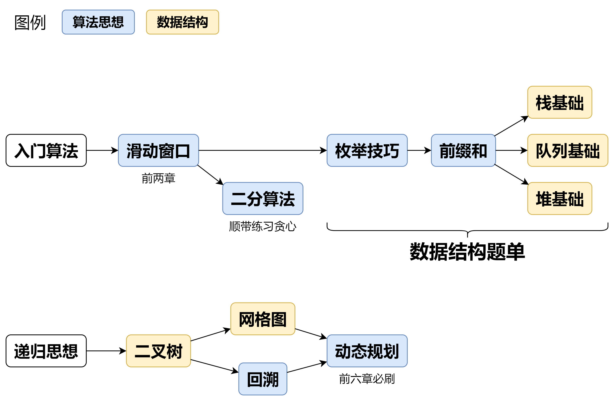
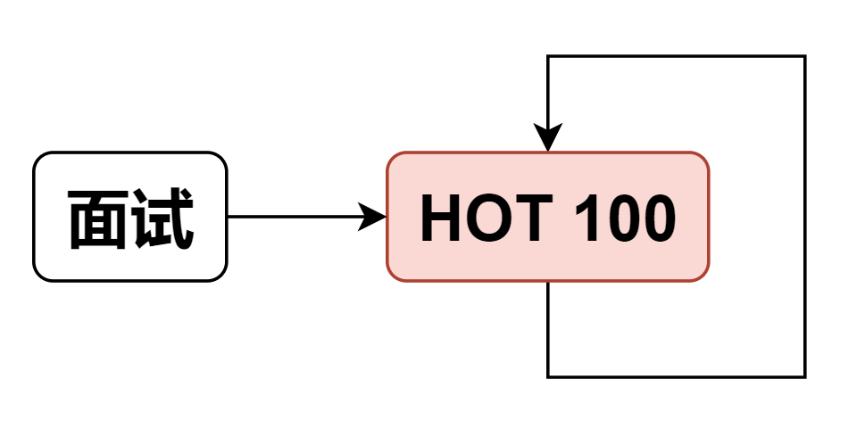

**如何科学刷题？**

> 合理运用心流通道，科学刷题，快乐刷题！

## 前言

怎么刷算法题？按照什么顺序刷题？如何科学地提高算法能力？

如果你刚开始刷题，还不熟悉**基本编程语法**和**常用库函数**，推荐先刷力扣官方的**入门题单**：

- [「新」动计划 · 编程入门](https://leetcode.cn/studyplan/primers-list/)（有两道数据库的题，可以跳过）

有了一些简单题的积累，就可以开始刷我的题单啦~

## 方法 A：专题训练

#### 刷题要点

- **按照专题刷题**，而不是随机刷题。同一个专题下的题目，套路是一样的，刷题效率杠杠滴~
- **螺旋上升式学习**：先完成 1700 难度分以下的题目。把各个知识点的基础题刷一遍，再刷更难的题目。

#### 核心刷题路线

**完成上述核心内容后，可以自由地刷其他知识点**。例如字典树、并查集等。

请结合 [基础算法精讲](https://leetcode.cn/link/?target=https%3A%2F%2Fwww.bilibili.com%2Fvideo%2FBV1bP411c7oJ%2F) 学习。

安装 [这个插件](https://leetcode.cn/link/?target=https%3A%2F%2Fscriptcat.org%2Fzh-CN%2Fscript-show-page%2F2778)，可以在题单中自动标记做过的题目。（注：需要在扩展程序的管理页面，开启开发者模式/开发人员模式。）

#### 完整题单

1.  [滑动窗口与双指针（定长/不定长/单序列/双序列/三指针/分组循环）](https://leetcode.cn/circle/discuss/0viNMK/)
2.  [二分算法（二分答案/最小化最大值/最大化最小值/第K小）](https://leetcode.cn/circle/discuss/SqopEo/)
3.  [单调栈（基础/矩形面积/贡献法/最小字典序）](https://leetcode.cn/circle/discuss/9oZFK9/)
4.  [网格图（DFS/BFS/综合应用）](https://leetcode.cn/circle/discuss/YiXPXW/)
5.  [位运算（基础/性质/拆位/试填/恒等式/思维）](https://leetcode.cn/circle/discuss/dHn9Vk/)
6.  [图论算法（DFS/BFS/拓扑排序/基环树/最短路/最小生成树/网络流）](https://leetcode.cn/circle/discuss/01LUak/)
7.  [动态规划（入门/背包/划分/状态机/区间/状压/数位/数据结构优化/树形/博弈/概率期望）](https://leetcode.cn/circle/discuss/tXLS3i/)
8.  [常用数据结构（前缀和/差分/栈/队列/堆/字典树/并查集/树状数组/线段树）](https://leetcode.cn/circle/discuss/mOr1u6/)
9.  [数学算法（数论/组合/概率期望/博弈/计算几何/随机算法）](https://leetcode.cn/circle/discuss/IYT3ss/)
10. [贪心与思维（基本贪心策略/反悔/区间/字典序/数学/思维/脑筋急转弯/构造）](https://leetcode.cn/circle/discuss/g6KTKL/)
11. [链表、二叉树与回溯（前后指针/快慢指针/DFS/BFS/直径/LCA/一般树）](https://leetcode.cn/circle/discuss/K0n2gO/)
12. [字符串（KMP/Z函数/Manacher/字符串哈希/AC自动机/后缀数组/子序列自动机）](https://leetcode.cn/circle/discuss/SJFwQI/)

> 对于**动态规划**，至少要做 道才算入门。

**优点**：按照题单专题刷，一个套路可以解决多个题目，刷题效率高。此外，**做同一个专题下的题目，相当于在从不同的角度去观察、思考同一个算法，这能让你更加深刻地理解算法的本质**。

**缺点**：提前知道题目类型，跳过了一些思考步骤。但比赛/笔试是不会告诉你这题是什么类型的，把 DP 想成贪心的大有人在。可以结合下面的方法 B，锻炼自己判断题目类型的能力。

## 方法 B：随机训练

与方法 A 互补，随机刷题。

1.  打开 [难度练习](https://leetcode.cn/link/?target=https%3A%2F%2Fhuxulm.github.io%2Flc-rating%2Fzen)。
2.  在设置中关闭算法标签。
3.  选择适合自己的难度范围。

**优点**：做题时不知道题目类型，可以增强实战能力；查漏补缺，检验自己的学习成果。

**缺点**：知识点有些零散，不如题单那么系统。

## 方法 C：突击训练

如果即将面试，时间紧迫，可以刷 [HOT 100](https://leetcode.cn/studyplan/top-100-liked/)，这些都是经典面试题。

另外还有一个 [面试 150](https://leetcode.cn/studyplan/top-interview-150/) 题单，其实它和 HOT 100 有很多重复题目，如果刷完 HOT 100 还有时间的话，可以刷这个 150 题单。

## 答疑

**问**：做题经常要看题解，怎么办？

**答**：看题解不丢人。甚至我觉得如果看题解的次数太少，说明做的题目太简单了，应该增加难度。

**问**：做题没思路，思考多久可以看题解？

**答**：10 分钟到数小时都可以。如果看完题解觉得题解很妙，那就学到了一个自己不会的技巧。如果看完题解觉得自己是xx，可以再多思考下，或者换个时间段（早/中/晚/洗澡的时候）思考，说不定就有思路了。（注：这在心理学上叫做**孵化效应**，即在离开问题后，大脑会在无意识中处理问题，从而在重返问题时突然产生新的思路。）

**问**：很多题目没有思路，很焦虑怎么办？

**答**：学算法是需要时间沉淀的，坚持刷题吧。现在不会的算法/题目，过段时间再来看，会有新的感悟。加油！

**问**：如何根据数据范围，估计题目允许的时间复杂度，从而估计要用什么算法？

**答**：一般每秒能执行约 次运算（Python 可能要除以 ），可以据此估计能通过的时间复杂度，如下表所示。

| 数据范围   | 允许的时间复杂度   | 适用算法**举例**                         |
| ---------- | ------------------ | ---------------------------------------- |
| *n*≤10     | O(*n*!) 或 O(C^n^) | 回溯、暴力搜索                           |
| *n*≤20     | O(2^n^)            | 状态压缩 DP                              |
| *n*≤40     | O(2^n/2^)          | 折半枚举                                 |
| *n*≤10^2^  | O(*n*^3^)          | 三重循环的 DP、Floyd                     |
| *n*≤10^3^  | O(*n*^2^)          | 二重循环的 DP、背包                      |
| *n*≤10^5^  | O(nlogn)           | 大多数题目都是这个范围，所以各类算法都有 |
| *n*≤10^6^  | O(*n*)             | 线性 DP、滑动窗口                        |
| *n*≤10^9^  | O($\sqrt{n}$)      | 判断质数                                 |
| *n*≤10^18^ | O(logn) 或 O(1)    | 二分、快速幂、数学公式                   |

**注**：实际做题时，注意常数因子的影响。例如哈希表比数组慢。
